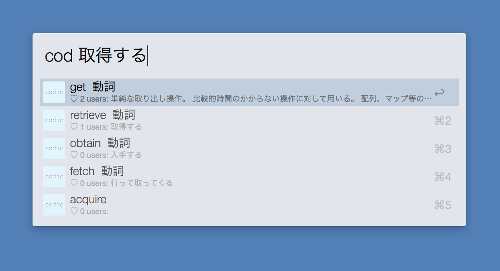

# codic4Alfred
workflow to get information from codic

# this version is incompletion 

# how to use
[download](./codic4Alfred.alfredworkflow?row=true)

1. You type "cod {query}"

you can type query both of in Japanse and in English.
If you type Japanese, the result is English.
Enter : copy and paste your select word in English.
Cmd + Enter : Open your detailed result in your browser
If you type English, the result is Japanese.
Enter : copy and paste your select word in Japanese.

I'm not sure that results are correct.
